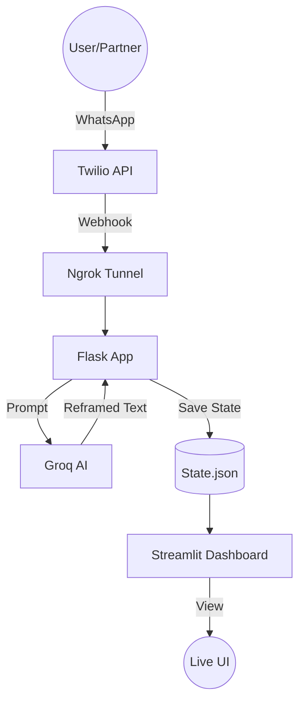

# 🕊️ The Reframing Room
> **Turning Conflict into Connection**

The Reframing Room is a professional AI-powered relationship mediator designed to help partners communicate effectively during high-stress conflicts. It intercepts raw, emotional messages sent via WhatsApp and reframes them into empathetic, need-based communication in real-time.

## 🚀 Key Features

### 1. The Translator (AI Component)
- **Real-time Reframing:** Converts aggressive "You" statements into constructive "I" statements.
- **Love Language Integration:** Tailors reframed responses to match your partner's specific love language (Acts of Service, Words of Affirmation, etc.).
- **Psychological Intelligence:** Powered by **Llama 3.3 70B** to detect hidden emotional needs and attachment styles.

### 2. Emotional Dashboard
- **Conflict Temperature:** A visual gauge that tracks the intensity of the current conversation.
- **Biometric Visualization:** Simulates emotional "Pulse" based on sentiment analysis.
- **Peace Offerings:** Generates actionable "Micro-Date" ideas to help reconnect after a conflict.

## 🛠️ Tech Stack

- **Backend:** Python / Flask
- **Intelligence:** Groq Cloud (Llama 3.3 70B)
- **Frontend:** Streamlit
- **Messaging:** Twilio WhatsApp API
- **Tunneling:** Ngrok (Secure cloud-to-local bridge)

## 🏗️ Architecture



## ⚙️ Setup & Installation

### 1. Prerequisites
- Homebrew & Python 3.14+
- Ngrok installed and authenticated

### 2. Installation
```bash
# Clone the repository
git clone https://github.com/viratsinghtomar9253-ux/the-reforming-state.git
cd the-reforming-state

# Set up virtual environment
python3 -m venv venv
source venv/bin/activate

# Install dependencies
pip install -r requirements.txt
```

### 3. Environment Variables
Create a `.env` file from the example:
```bash
cp .env.example .env
```
Fill in your credentials:
- `GROQ_API_KEY`: Your Groq Cloud API key.
- `TWILIO_ACCOUNT_SID`: From Twilio Console.
- `TWILIO_AUTH_TOKEN`: From Twilio Console.

### 4. Running the App
1. **Start the Backend:**
   ```bash
   python app.py
   ```
2. **Start the Tunnel:**
   ```bash
   ngrok http 8000
   ```
3. **Start the Dashboard:**
   ```bash
   streamlit run dashboard.py
   ```

## 🔮 Future Roadmap
- [ ] **Multi-Platform Support:** Integration for Slack and Discord.
- [ ] **Wearable Integration:** Real-time heart rate syncing with Apple Watch/Fitbit.
- [ ] **Long-term Analytics:** Tracking relationship growth and communication patterns over time.

---
**Turning Conflict into Connection.**
